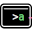

<p align="center"></p>
<h1 align="center">Command Line Parameters Reader</h1>

A procedural approach to command line parameters reading, that does not require any initial setup and does not impose any design choices on your application.  

While it's very flexible, and easy to use, there is no auto generation of usage messages, man pages, or  shell autocomplete, these have to be defined separately.

## Basic Usage
Initialize a new reader:
```cs
var reader = new ParametersReader(args);
```
Read values:
```cs
// first value
var path = reader.ReadValue();

// second value (parsed)
var count = reader.ReadValue(Int32.Parse, 1);
```

Read parameters and switches (in any order):
```cs
// required parameter
var path = reader.ReadParameterValue("path", "p");

// optional parameter (with default value)
var date = reader.ReadParameterValue("date", "d", DateTime.Parse, DateTime.Now);

// switch (always optional)
var force = reader.ReadSwitch("force");
```

Finally, validate that all the values and parameters have been matched:
```cs
reader.ValidateEmpty();
```

## Examples
More usage examples can be found under the [examples](https://github.com/ytt0/softpatterns-cli-reader/tree/main/examples) folder.

## Advanced Usage

### Read Global Parameters and Values
Global parameters (such as the help switch), should be matched before any downstream read operations:
```cs
// read global values
var showHelp = reader.ReadSwitch("help", "?");
var configPath = reader.ReadParameterValue("config", "c", ".toolconfig");

// ... continue reading

// propagate values
RunCommand(configPath);
```

### Commands Semantic
The first value can be matched as a command name in the following way:

```cs
// ... read global parameters

if (reader.TryReadValue("add"))
{
    RunAddCommand(reader, ..., showHelp);
    return;
}

if (reader.TryReadValue("list"))
{
    RunListCommand(reader, ..., showHelp);
    return;
}
```
Nested sub-commands could be matched similarly at each respected command.

If none of the match attempts were successful, throw an exception with a list of the  attempted values (and use a "command" noun in the exception message).
```cs
reader.ThrowUnmatchedValueException("command");
```

The exception message may look like this:
```
command 'show' is invalid

Available commands are:
    add
    list
```

### Usage Errors
Methods that do not start with `Try`, may throw a `UsageException`, with a message that can be displayed to the user (and can be customized if needed). The reading process may be wrapped with a `try-catch` statement to catch and display usage error messages:
```cs
try
{
    var reader = new ParametersReader(args);

    // reader.Read ...
    // ... an exception may be thrown during the reading process

    // may throw an exception if not empty
    reader.ValidateEmpty();

    RunCommand(...);
}
catch (UsageException e)
{
    Console.Error.WriteLine($"Error: {e.Message}");
}
```

### Spelling Mistakes Detection
Exceptions from both `ValidateEmpty`, and `ThrowUnmatchedValueException` methods may include a list of similar parameters names or values in their message, that may look like this:
```
day 'sumday' is invalid

The most similar day is:
    Sunday
```

### Custom Aliases
Commonly used parameters combinations could be replaced with custom shortcuts (similar to git aliases configuration), in the following way:
```cs
reader.TrySubstituteValueArgs(
    "add-important",
    "add --priority high --content".Split(' '));
```
Note that a second reading pass of previously matched parameters may be needed.

### Backward Compatibility
Legacy parameters names and values that have been changed in newer versions of the application, could be replaced before they are being matched, to support existing scripts that may still use them:
```cs
// before trying to read global or local parameters
reader.TrySubstituteParameter("importance", "i", "priority");

// ... continue reading the new parameters
reader.ReadParameterValue("priority", ...);
```

```cs
// before trying to match command names
reader.TrySubstituteValue("push", "add");

// ... continue reading the new commands
if (reader.TryReadValue("add")) ...
```


# Design Details
There are two components that are used for parsing and reading the command line arguments, a lexer, and a reader.

## Lexer
The lexer is responsible to convert raw command line arguments into a list of tokens, that could be matched by the reader.

Each token should have one or more parent tokens, with a root of a `RawArg` token.  
Only tokens of type `Name`, `ShortName`, `Value`, and `AttachedValue` are expected by the reader.

For example, the raw arguments `["value1", "--parameter1", "--parameter2=value2", "-abc"]` will be converted to the following tokens hierarchy:

- `[RawArg "value"]`
    - `[Value "value1"]`
- `[RawArg "--parameter1"]`
    - `[Name "parameter1"]`
- `[RawArg "--parameter2=value2"]`
    - `[Name "parameter2"]`
    - `[AttachedValue "value2"]`
- `[RawArg "-abc"]`
    - `[NameGroup "abc"]`
        - `[ShortName "a"]`
        - `[ShortName "b"]`
        - `[ShortName "c"]`

Each token contains a reference to its parent, and additional properties (such as child index, and value substring position).
The lexer would return only the list of leaves.

#### Replacing Tokens
When a token is being replaced, the tree is amended, with new tokens that are pointing to the replaced token (no tokens are removed). For example, the following request:
```cs
reader.TrySubstituteValueArgs(
    "add-important",
    "add --priority high --content".Split(' '));
```

Will modify this tree:

- `[RawArg "add-important"]`
    - `[Value "add-important"]`

Into this tree:
- `[RawArg "add-important"]`
    - `[Value "add-important"]`
        - `[RawArg "add"]`
            - `[Value "add]`
        - `[RawArg "--priority"]`
            - `[Name "priority"]`
        - `[RawArg "high"]`
            - `[Value "high]`
        - `[RawArg "--content"]`
            - `[Name "content"]`

## Reader
The reader uses the lexer to create the list of tokens, and abstracts value read operations with tokens match operations.

The reader has two matching modes:
- Value matching mode
    - The reader points to the first unmatched token.
    - The reader allows matching a value, if it points to a `Value` token.
    - After matching a value, the reader points to the next unmatched token (may skip any number of already matched tokens).
- Parameter value matching mode
    - The reader matches an unmatched `Name` or `ShortName` token (at any position in the list), and points to the following token.
    - The reader allows matching a value if it points to an unmatched `Value` or `AttachedValue` token.
    - After matching a value, the reader points to the next token (without skipping already matched tokens, like in value matching mode).
    - On parameter match end, the reader moves back to value matching mode.

### Reader Example
Tokens matching example
```cs
var args = new [] { "value1", "--parameter2", "value3", "value4" };

// tokens: [Value "value1"], [Name "parameter2"], [Value "value3"], [Value "value4"]
var reader = new ParametersReader(args);

// match [Value "value1"] token
var valueToken1 = reader.MatchValue();

// trying to match the next value will return false, as the reader
// is pointing to a name token ([Name "parameter2"])
reader.TryMatchValue(out _); // == false

// match [Name "parameter2"] token, and point to the next token
var parameterToken2 = reader.MatchParameter("parameter2");

// match [Value "value3"] token
var valueToken3 = reader.MatchValue();

// reset the reader position back to the first unmatched token
reader.MatchParameterEnd();

// match [Value "value4"] token
var valueToken4 = reader.MatchValue();

// make sure that all the tokens were matched
reader.ValidateEmpty();
```
